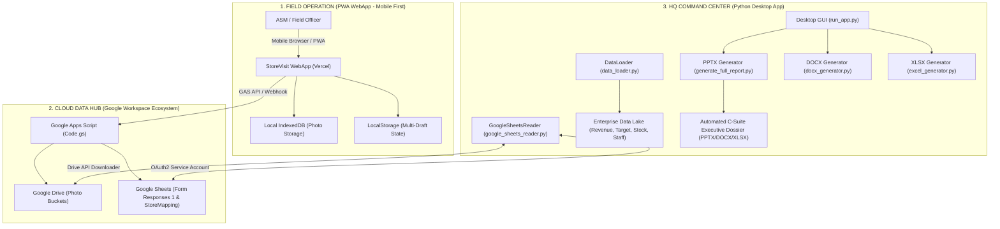

# RETAIL COMMANDER: STORE VISIT & FIELD EXCELLENCE PLATFORM
> **Hệ Thống Quản Trị & Kiểm Tra Hiện Trường Bán Lẻ Đa Điểm Chuẩn Doanh Nghiệp (Top 0.1% Retail Engineering)**

---

## 1. TỔNG QUAN HỆ THỐNG (SYSTEM OVERVIEW)

**Retail Commander - StoreVisit** là nền tảng quản trị và hỗ trợ vận hành hiện trường tích hợp dành cho chuỗi 185+ cửa hàng bán lẻ thời trang cao cấp An Phước - Pierre Cardin trên toàn quốc. Hệ thống kết nối liền mạch giữa:
1. **PWA Mobile WebApp (`storevisit-six.vercel.app`)**: Ứng dụng hiện trường dành cho 11 Quản Lý Khu Vực (ASM) và Ban Giám Đốc, hoạt động trực tiếp trên điện thoại/máy tính bảng với kiến trúc Offline-First (IndexedDB + Service Worker + LocalStorage).
2. **Google Cloud Data Hub (Sheets & Drive API)**: Trục truyền thông dữ liệu hai chiều giữa hiện trường và văn phòng trung tâm, đồng bộ tự động ảnh và biểu mẫu kiểm tra.
3. **Core Desktop Engine (Python / CustomTkinter / Data Loader)**: Bộ vi xử lý dữ liệu doanh nghiệp tại văn phòng, kết nối trực tiếp với Data Lake doanh nghiệp (`Fact_Revenue`, `TargetMonthly`, `MART_Stock`, `MART_Health_Master`), tự động hóa việc đồng bộ, kiểm duyệt chất lượng dữ liệu (QC) và tạo ra báo cáo đa định dạng (PowerPoint 13+ slides, Word DOCX, Excel XLSX).

---

## 2. KIẾN TRÚC TỔNG THỂ (SYSTEM ARCHITECTURE)



---

## 3. CẤU TRÚC THƯ MỤC DỰ ÁN (PROJECT REPOSITORY STRUCTURE)

```text
StoreVisit/
├── config/                                 # Cấu hình hệ thống & Khóa bảo mật
│   ├── app_config.yaml                     # File cấu hình trung tâm (Paths, Timeouts, Google API, Email)
│   ├── field_mapping.yaml                  # Ánh xạ tên trường từ điển dữ liệu
│   └── google_credentials.json             # Service Account OAuth2 Key kết nối Google Cloud
├── data/                                   # Module nạp, xử lý và lưu trữ bộ nhớ đệm
│   ├── data_loader.py                      # Bộ nạp dữ liệu Data Lake (Doanh thu, Mục tiêu, Tồn kho, Nhân sự)
│   ├── data_validator.py                   # Bộ kiểm duyệt và làm sạch dữ liệu đầu vào
│   ├── drive_image_downloader.py           # Bộ tải ảnh đa luồng từ Google Drive
│   ├── form_response_cache.py              # Quản lý bộ nhớ đệm phản hồi form nội bộ
│   ├── google_sheets_reader.py             # Bộ đọc và ghi kết quả Google Sheets API v4
│   ├── inventory_repository.py             # Truy vấn và tổng hợp chỉ số tồn kho
│   ├── models.py                           # Định nghĩa cấu trúc dữ liệu Pydantic / Dataclasses
│   ├── revenue_repository.py               # Xử lý và tính toán phân tích doanh thu
│   └── source_snapshot.py                  # Chụp và đối soát dữ liệu snapshot
├── generators/                             # Bộ sinh báo cáo đa định dạng
│   ├── pptx_generator/                     # Engine sinh slide PowerPoint chuyên nghiệp (13+ slides)
│   │   ├── audit_slides.py                 # Slide điểm checklist, mặt tiền, trưng bày, CSVC, nhân sự
│   │   ├── cover_slide.py                  # Slide bìa tiêu chuẩn nhận diện thương hiệu
│   │   ├── issue_action_slides.py          # Slide vấn đề tồn đọng & kế hoạch hành động
│   │   ├── revenue_slides.py               # Slide biểu đồ phân tích doanh thu và mục tiêu MTD
│   │   └── summary_slide.py                # Slide tổng kết và ma trận hành động
│   ├── docx_generator.py                   # Sinh biên bản làm việc Word (DOCX)
│   └── excel_generator.py                  # Sinh bảng đối soát chi tiết Excel (XLSX)
├── templates/                              # Mẫu slide PowerPoint & văn bản gốc
├── webapp/                                 # Mã nguồn Frontend WebApp PWA
│   ├── Code.gs                             # Backend Google Apps Script (API endpoints, Auth, GSheet sync)
│   ├── index.html                          # Single Page Application HTML5/CSS3/JavaScript (8.600+ dòng)
│   ├── store_mapping.json                  # Cấu hình ánh xạ 185 Cửa hàng & 11 ASM
│   └── store_profile_map.json              # Hồ sơ đặc tính 185 cửa hàng (DT, Bảo vệ, Phân hạng)
├── run_app.py                              # Ứng dụng Desktop Command Center (CustomTkinter GUI)
├── GoogleSheets_Setup_Guide.md             # Hướng dẫn thiết lập bảng tính và Google Forms
└── README.md                               # Tài liệu kiến trúc toàn diện dự án
```

---

## 4. MA TRẬN 11 NHÓM ASM & 185 CỬA HÀNG (SINGLE SOURCE OF TRUTH)

Dữ liệu được chuẩn hóa và đồng bộ 100% từ bảng danh bạ chuẩn `C:\All_Report\1_Mapping\StoresInfo.xlsx`:

| STT | ASM Quản Lý | Tài Khoản (Username) | Mật Khẩu Khởi Tạo | Số Lượng CH | Vùng Phụ Trách |
| :---: | :--- | :---: | :---: | :---: | :--- |
| 1 | **Nguyễn Đăng Khôi** (Master) | `khoi` / `khoind` | `khoi6868` | 17 | HCM (Phú Mỹ Hưng, Quận 7, Q4, Nhà Bè...) |
| 2 | **Đỗ Thị Hoa Tiên** | `tien` | `tien2026` | 18 | HCM (Diamond, Q1, Hai Bà Trưng, Nguyễn Trãi...) |
| 3 | **Đoàn Thị Kim Hương** | `huong` | `huong2026` | 23 | Miền Tây & Miền Trung - Tây Nguyên (Cần Thơ, Cao Lãnh...) |
| 4 | **Trần Thanh Dũng** | `ttdung` | `dung2026` | 10 | Miền Tây & HCM (Kinh Dương Vương, Mỹ Tho, Bến Tre...) |
| 5 | **Nguyễn Quốc Dũng** | `dung` | `dung2026` | 15 | HCM & Tây Nguyên (Cộng Hòa, Trường Chinh, Đà Lạt, Gia Lai...) |
| 6 | **Đinh Thị Cát Linh** | `linh` | `linh2026` | 18 | HCM (Landmark 81, Hai Bà Trưng, Quận 3...) |
| 7 | **Hồ Thị Lâm** | `lam` | `lam2026` | 6 | HCM (Hùng Vương Plaza, Vạn Hạnh Mall, Vincom...) |
| 8 | **Nguyễn Lâm Trung Tín** | `tin` | `tin2026` | 14 | Miền Đông & HCM (Thủ Đức, Bình Phước, Bình Dương...) |
| 9 | **Nguyễn Lê Quân** | `quan` | `quan2026` | 18 | Miền Trung - Tây Nguyên (Huế, Đà Nẵng, Quảng Trị...) |
| 10 | **HN (Hà Nội & Miền Bắc)** | `hn` | `hn2026` | 45 | Vùng Hà Nội & Các tỉnh phía Bắc |
| 11 | **Ni (Kênh Online)** | `ni` | `ni2026` | 1 | Kênh Thương Mại Điện Tử & Website |

---

## 5. BẢN THIẾT KẾ ĐỊNH HƯỚNG NÂNG CẤP TOÀN DIỆN (NEXT-GEN ROADMAP)

Nhằm đáp ứng yêu cầu chiến lược từ Ban Giám Đốc và thực tiễn vận hành bán lẻ, hệ thống chuẩn bị bước vào giai đoạn tái cấu trúc với 3 trụ cột:

### Trụ Cột 1: Cơ Cấu Lại Nội Dung Kiểm Tra Theo Tần Suất & Địa Lý
* **Cửa Hàng Nội Thành HCM (Tần suất cao: 2-3 lần/tuần)**: Áp dụng **Biên bản Kiểm tra Nhanh (Quick Pulse Check - 5-10 phút)** tập trung vào: Thái độ nhân viên, Tình trạng thiếu hàng nóng/Size hụt, Tiến độ xử lý vấn đề tồn đọng từ lần trước, Doanh thu ngày vs Mục tiêu. Tránh lặp lại 52 câu hỏi toàn diện gây lãng phí thời gian.
* **Cửa Hàng Tỉnh / Xa (>30km từ Quận 5 - Tần suất thấp: 2-3 tháng/lần)**: Áp dụng **Đại Kiểm Tra 360 Độ (Comprehensive Deep Audit)** bao gồm đầy đủ 52 tiêu chuẩn CSVC, Kho bãi, Biển hiệu, Tài sản cố định, Khảo sát thị trường đối thủ địa phương.

### Trụ Cột 2: Module Cứu Cánh / Thúc Đẩy Cửa Hàng Chậm Tiến Độ (Target Lagging Action Hub)
Khi Ban Giám Đốc chỉ định ASM xuống cứu cửa hàng chậm target, WebApp sẽ tự động nạp **Hồ Sơ Chẩn Đoán Cửa Hàng (Store Diagnostic Dossier)** từ Google Drive/Sheets theo 5 chiều không gian quản trị bán lẻ hiện đại:
1. **Doanh Thu (Revenue Gap & Conversion)**: Tỷ lệ đạt mục tiêu MTD %, Doanh thu cần đạt mỗi ngày còn lại, Giá trị đơn bình thường (ATV), Số sản phẩm/đơn (UPT).
2. **Hàng Hóa (Merchandising Health)**: Top 5 mã chạy bị đứt size, Hàng tồn kho trên 180 ngày, Nhóm hàng hụt tỷ trọng so với trung bình vùng.
3. **Khách Hàng (Customer & Market Traffic)**: Lượng khách vào cửa hàng (Footfall), Tỷ lệ chuyển đổi, Tình hình cạnh tranh và khuyến mãi của đối thủ lân cận.
4. **Nhân Sự (Human Capital)**: Định biên nhân viên, Đánh giá kỹ năng chốt sale, Năng lượng phục vụ, Động lực hoa hồng/thưởng.
5. **Vận Hành & Trưng Bày (VM & Operations)**: Độ hút mắt của Ma-nơ-canh mặt tiền, Điểm nóng quầy kệ, Tình trạng máy lạnh, ánh sáng, POS.

### Trụ Cột 3: Tái Thiết Kế Giao Diện Chuẩn Apple iOS / macOS HIG (Mobile-First)
* Thiết kế hiện đại dạng thẻ bo tròn mượt mà (Rounded Cards), thanh điều hướng nổi (Floating Segmented Bar), hỗ trợ thao tác một tay ngón cái.
* Chế độ lưu nháp thông minh, phản hồi xúc giác thị giác (Haptic-like visual feedback), chế độ chụp ảnh tối ưu dung lượng (Auto Smart Compression).

---

## 6. HƯỚNG DẪN VẬN HÀNH & TRIỂN KHAI (QUICK START)

### 6.1. Khởi Chạy Ứng Dụng Desktop (HQ Command Center)
```powershell
# Kích hoạt môi trường ảo Python
.venv\Scripts\Activate.ps1

# Chạy ứng dụng giao diện điều hành
python run_app.py
```

### 6.2. Kiểm Thử Hệ Thống & Kiểm Tra Cú Pháp Toàn Bộ (Full QC)
```powershell
# Kiểm tra cú pháp JavaScript của WebApp
python scratch/check_js_syntax.py

# Kiểm tra xác thực 11 ASM và 185 cửa hàng
python scratch/verify_all_logins_and_mappings.py

# Kiểm thử luồng xác thực và lưu đa bản nháp
python scratch/verify_fullscreen_auth_and_multidraft.py

# Kiểm thử xác thực submit form Google Apps Script (24 Test Cases)
python scratch/test_live_submission_validation.py

# Kiểm thử sinh báo cáo toàn diện E2E (PPTX, DOCX, XLSX)
python scratch/test_pipeline_e2e.py
```

---
*Bản quyền thuộc Hệ Thống Bán Lẻ An Phước - Pierre Cardin.*
