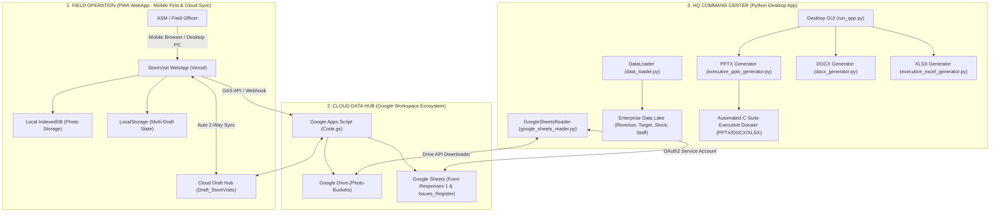

# RETAIL COMMANDER: STORE VISIT & FIELD EXCELLENCE PLATFORM
> **Hệ Thống Quản Trị & Thị Sát Hiện Trường Bán Lẻ Đa Điểm Chuẩn Doanh Nghiệp (Top 0.1% Retail Engineering)**

---

## 1. TỔNG QUAN HỆ THỐNG (SYSTEM OVERVIEW)

**Retail Commander - StoreVisit** là nền tảng quản trị và hỗ trợ vận hành hiện trường tích hợp dành cho chuỗi 185+ cửa hàng bán lẻ thời trang cao cấp An Phước - Pierre Cardin trên toàn quốc. Hệ thống kết nối liền mạch giữa:
1. **PWA Mobile WebApp (`storevisit-six.vercel.app`)**: Ứng dụng hiện trường dành cho 11 Quản Lý Khu Vực (ASM) và Ban Giám Đốc, tối ưu hóa 100% hiển thị trên điện thoại di động (Mobile Responsive), tích hợp cơ chế lưu trữ Offline-First (IndexedDB + LocalStorage) và **Đồng bộ bản nháp Đám Mây 2 chiều (Cloud Draft Sync)** qua Google Sheets API.
2. **Google Cloud Data Hub (Sheets & Drive API)**: Trục truyền thông dữ liệu hai chiều giữa hiện trường và văn phòng trung tâm, đồng bộ tự động ảnh, biểu mẫu kiểm tra và bản nháp dở dang (`Draft_StoreVisits`).
3. **Core Desktop Engine (Python / CustomTkinter / Data Loader)**: Bộ vi xử lý dữ liệu doanh nghiệp tại văn phòng, kết nối trực tiếp với Data Lake doanh nghiệp (`Fact_Revenue`, `TargetMonthly`, `MART_Stock`, `MART_Health_Master`), tự động hóa việc đồng bộ, kiểm duyệt chất lượng dữ liệu (QC) và tạo ra báo cáo đa định dạng (PowerPoint 13+ slides, Word DOCX, Excel XLSX).

---

## 2. KIẾN TRÚC TỔNG THỂ (SYSTEM ARCHITECTURE)



---

## 3. CƠ CẤU 3 CHẾ ĐỘ THỊ SÁT HIỆN TRƯỜNG (3 OPERATIONAL PROFILES)

Nhằm tối ưu hóa thời gian và nguồn lực của ASM tại từng điểm bán, hệ thống phân chia rõ 3 chế độ kiểm tra:

### 🏢 Chế Độ 1: Kiểm Tra Toàn Diện Định Kỳ (Full Audit 9 Tabs / 65 Tiêu Chí)
* **Đối tượng**: Cửa hàng định kỳ tháng/quý hoặc cửa hàng tỉnh xa (>30km).
* **Nội dung**: Đánh giá toàn diện 9 tabs:
  1. Ngoại quan & Mặt tiền cửa hàng (Frontage)
  2. Không gian bên trong (Inner)
  3. Trưng bày Visual Merchandising An Phước (AP)
  4. Trưng bày Visual Merchandising Pierre Cardin (PIE)
  5. Trưng bày Visual Merchandising Anamai (Nội y & Mặc nhà)
  6. Trưng bày Visual Merchandising Bonjour (Phụ kiện & Thời trang nữ)
  7. Nhân sự & Tác phong phục vụ (Staff)
  8. Khảo sát thị trường & Đối thủ cạnh tranh (Competitor Survey)
  9. Cơ sở vật chất, PCCC & Vận hành (CSVC / PCCC / Security)

### ⚡ Chế Độ 2: Kiểm Tra Nhanh Tác Chiến (Quick Pulse - 15 Phút)
* **Đối tượng**: Cửa hàng nội thành ghé thăm thường xuyên (2-3 lần/tuần).
* **Nội dung**: Chạm 1 chạm kiểm tra nhanh 6 trọng điểm: Đồng phục & tác phong, Máy lạnh & vệ sinh, Mặt tiền & trưng bày, Kho hàng & quầy thu ngân, Vấn đề tồn đọng lần trước, và Hướng dẫn Cửa hàng trưởng.

### 🎯 Chế Độ 3: Cứu Doanh Số & Hỗ Trợ CHT (5 Trụ Cột Báo Động Đỏ)
* **Đối tượng**: Cửa hàng chậm target, doanh thu sụt giảm cần Ban Giám Đốc & ASM can thiệp khẩn cấp.
* **Nội dung**: Mổ xẻ nguyên nhân và lên cam kết hành động trên 5 Trụ Cột:
  1. **Doanh thu**: MTD Actual vs Target, Nhịp độ bán (Pace Delta), Doanh thu cần đạt mỗi ngày còn lại.
  2. **Hàng hóa**: Tồn kho cũ >180 ngày, Top 5 mã chạy bị đứt size, Hàng tồn đọng.
  3. **Khách hàng**: Lượng khách vào cửa hàng (Footfall), Tỷ lệ chuyển đổi (Conversion Rate), Tình hình đối thủ cạnh tranh.
  4. **Nhân sự**: Định biên nhân viên trực ca, Năng lượng phục vụ, Kỹ năng chốt sale.
  5. **Vận hành**: CSVC, Điểm nóng quầy kệ, Khó khăn ghi nhận từ CHT ngoài 5 hạng mục trên.

---

## 4. MA TRẬN 11 NHÓM ASM & 185 CỬA HÀNG (SINGLE SOURCE OF TRUTH)

Dữ liệu được chuẩn hóa và đồng bộ 100% từ bảng danh bạ chuẩn `C:\All_Report\1_Mapping\StoresInfo.xlsx`:

| STT | ASM Quản Lý | Tài Khoản (Username) | Mật Khẩu Khởi Tạo | Số Lượng CH | Vùng Phụ Trách |
| :---: | :--- | :---: | :---: | :---: | :--- |
| 1 | **Nguyễn Đăng Khôi** (Master) | `khoi` / `khoind` | `khoi6868` | 17 | HCM (Phú Mỹ Hưng, Quận 7, Q4, Nhà Bè, Vũng Tàu, Bình Dương...) |
| 2 | **Đỗ Thị Hoa Tiên** | `tien` | `tien2026` | 18 | HCM (Diamond, Q1, Hai Bà Trưng, Nguyễn Trãi, Takashimaya...) |
| 3 | **Đoàn Thị Kim Hương** | `huong` | `huong2026` | 23 | Miền Tây & Miền Trung - Tây Nguyên (Cần Thơ, Cao Lãnh, Long Xuyên...) |
| 4 | **Trần Thanh Dũng** | `ttdung` | `dung2026` | 10 | Miền Tây & HCM (Kinh Dương Vương, Hậu Giang, Mỹ Tho, Bến Tre...) |
| 5 | **Nguyễn Quốc Dũng** | `dung` | `dung2026` | 15 | HCM & Tây Nguyên (Cộng Hòa, Trường Chinh, Đà Lạt, Gia Lai...) |
| 6 | **Đinh Thị Cát Linh** | `linh` | `linh2026` | 18 | HCM (Landmark 81, Hai Bà Trưng, Cao Thắng, Quận 3...) |
| 7 | **Hồ Thị Lâm** | `lam` | `lam2026` | 6 | HCM (Hùng Vương Plaza, Vạn Hạnh Mall, Vincom Grand Park...) |
| 8 | **Nguyễn Lâm Trung Tín** | `tin` | `tin2026` | 14 | Miền Đông & HCM (Thủ Đức, Biên Hòa, Bình Phước, Tây Ninh...) |
| 9 | **Nguyễn Lê Quân** | `quan` | `quan2026` | 18 | Miền Trung - Tây Nguyên (Huế, Đà Nẵng, Nha Trang, Quảng Trị...) |
| 10 | **HN (Hà Nội & Miền Bắc)** | `hn` | `hn2026` | 45 | Vùng Hà Nội & Các tỉnh phía Bắc (Hải Phòng, Quảng Ninh, Vinh...) |
| 11 | **Ni (Kênh Online)** | `ni` | `ni2026` | 1 | Kênh Thương Mại Điện Tử & Website |

---

## 5. TÍNH NĂNG ĐỒNG BỘ ĐA THIẾT BỊ & DI ĐỘNG (CROSS-DEVICE CLOUD SYNC)

1. **Đồng bộ đám mây 2 chiều (Cloud Draft Sync)**:
   - Bản nháp được lưu đồng thời tại bộ nhớ máy (`IndexedDB`/`localStorage`) và tự động đồng bộ ngầm lên Google Sheets tab `Draft_StoreVisits`.
   - ASM bắt đầu nhập trên điện thoại $
ightarrow$ Về văn phòng mở máy tính có thể bấm nút **"☁️ Tải Bản Nháp Từ Cloud"** để tiếp tục hoàn thiện và gửi báo cáo.
2. **Thiết kế Mobile Responsive Chuẩn Apple HIG**:
   - Tối ưu 100% hiển thị trên màn hình di động ($\le 430	ext{px}$), nút bấm kích thước chuẩn Touch Target ($\ge 44	ext{px}$), chống tràn dòng và không bị đè chữ.

---

## 6. HƯỚNG DẪN VẬN HÀNH & TRIỂN KHAI (QUICK START)

### 6.1. Khởi Chạy Ứng Dụng Desktop (HQ Command Center)
```powershell
# Kích hoạt môi trường ảo Python
.venv\Scripts\Activate.ps1

# Chạy ứng dụng giao diện điều hành
python run_app.py
```

### 6.2. Kiểm Thử Hệ Thống & Kiểm Tra Cú Pháp Toàn Bộ (Full QC)
```powershell
# Kiểm tra cú pháp JavaScript & HTML WebApp
python scratch/check_js_syntax.py

# Kiểm thử Selenium E2E trên Mobile Viewport & Cloud Draft Sync
python scratch/test_selenium_mobile_and_cloud_sync.py

# Kiểm thử toàn diện tất cả các chế độ gửi báo cáo
python scratch/test_selenium_full_suite.py
```

---
*Bản quyền thuộc Hệ Thống Bán Lẻ An Phước - Pierre Cardin.*
